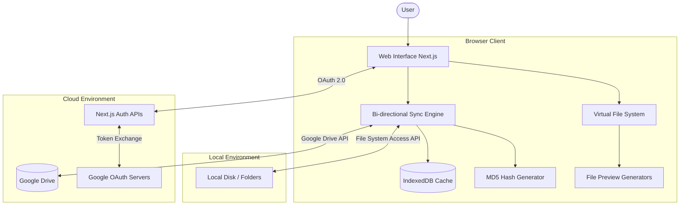
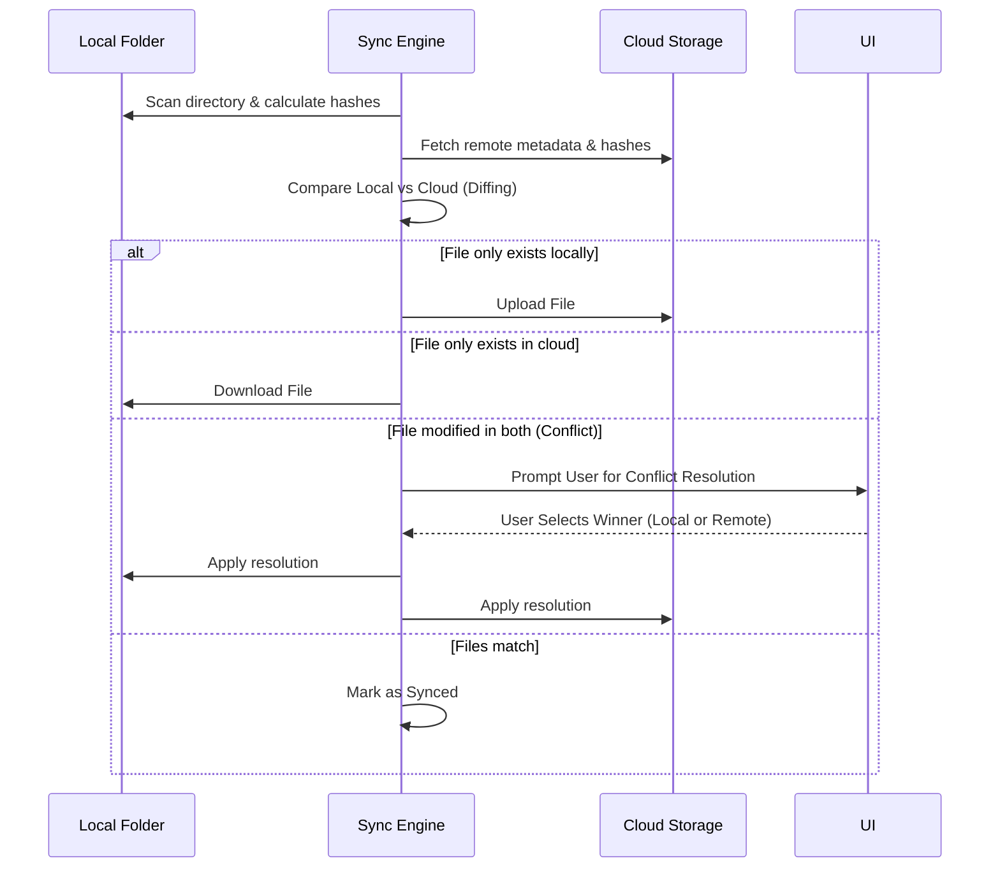

<div align="center">
  

  # ☁️ CloudSync

  *A powerful, modern, web-based, bi-directional file synchronization application.*

  [](https://nextjs.org/)
  [](https://react.dev/)
  [](https://www.typescriptlang.org/)
  [](https://tailwindcss.com/)
</div>

<br />

CloudSync seamlessly bridges the gap between your local file system and cloud storage (Google Drive) **directly from the browser**. No desktop client installation required. By utilizing the modern Web File System Access API, it brings native-like sync capabilities right to your web browser.

---

## 🎯 Why CloudSync?

- **Zero Installation**: Sync your files without downloading hefty desktop applications.
- **Privacy First**: Files are synchronized directly between your local machine and your Google Drive. No intermediary servers hold your files.
- **Granular Control**: Manage conflicts manually or use `.syncignore` to ensure only the right files are synced.

---

## ✨ Key Features

- **🔄 Bi-directional Sync**: Real-time or manual synchronization between local directories and the cloud.
- **📁 Native File System Access**: Leverages the modern web File System Access API to securely interact with local folders directly.
- **⚔️ Smart Conflict Resolution**: An interactive UI to intelligently resolve collisions when files are modified both locally and remotely.
- **🚫 `.syncignore` Support**: Fully customizable ignore patterns using `.syncignore` (similar to `.gitignore`) to exclude `node_modules`, temp files, or private data.
- **👁️ Rich File Previews**: Built-in viewing capabilities for PDFs, Word documents (`.docx`), Images, and Text/Code without ever leaving the app.
- **📊 Storage Analytics**: Beautiful, interactive charts visualizing your storage usage and file distributions.
- **🔋 Wake Lock Management**: Utilizes the Screen Wake Lock API to prevent the device from going to sleep during prolonged synchronization tasks.
- **⚡ High-Performance Virtualization**: Smoothly renders massive directories containing thousands of files using virtualized lists.

---

## 🛠️ Tech Stack

| Category | Technology | Description |
| :--- | :--- | :--- |
| **Frontend** | [Next.js](https://nextjs.org/) & [React 19](https://react.dev/) | Core application framework and UI library. |
| **Language** | [TypeScript](https://www.typescriptlang.org/) | Strongly typed JavaScript. |
| **Styling** | [Tailwind CSS v4](https://tailwindcss.com/) & [Framer Motion](https://motion.dev/) | Utility-first styling and fluid animations. |
| **Icons** | [Lucide React](https://lucide.dev/) | Clean and consistent iconography. |
| **Local Data** | IndexedDB (`idb-keyval`) | Efficient metadata and state persistence. |
| **Auth** | Next.js API Routes | Custom, secure OAuth 2.0 flow for Google integration. |
| **Utilities** | `@tanstack/react-virtual` | Windowing for large lists. |
| | `spark-md5` | Fast client-side file hashing for change detection. |
| | `pdfjs-dist` & `mammoth` | Document preview processing. |
| | `recharts` | Data visualization. |

---

## 🏗️ Architecture & Workflow

### High-Level Architecture



### Sync Resolution Workflow



---

## 🚀 Getting Started

### Prerequisites
- Node.js (v20+ recommended)
- A Google Cloud Console project (for Drive API and OAuth 2.0 credentials)

### Installation

1. **Clone the repository:**
   ```bash
   git clone https://github.com/Virendra-Phirke/CloudSync.git
   cd CloudSync
   ```

2. **Install dependencies:**
   ```bash
   npm install
   ```

3. **Environment Setup:**
   Create a `.env.local` file in the root directory. You will need to configure your Google OAuth credentials:
   ```env
   # Google OAuth Configuration
   GOOGLE_CLIENT_ID="your_google_client_id_here"
   GOOGLE_CLIENT_SECRET="your_google_client_secret_here"
   APP_URL="http://localhost:3000"
   GOOGLE_REDIRECT_URI="http://localhost:3000/api/auth/callback/google"
   ```

4. **Run the development server:**
   ```bash
   npm run dev
   ```

5. Open [http://localhost:3000](http://localhost:3000) in your browser.

---

## 💡 Usage Guide

1. **Authenticate**: Log in with your Google account to grant CloudSync access to your Google Drive.
2. **Select Local Folder**: Use the UI to pick a local folder on your machine that you want to sync.
3. **Configure `.syncignore`**: Add a `.syncignore` file in your local folder to ignore specific files/directories (e.g., `node_modules/`, `.git/`).
4. **Sync**: Click the "Sync" button. CloudSync will analyze differences, prompt you to resolve any conflicts, and keep your files up-to-date!

---

## 📁 Project Structure

```text
├── app/                  # Next.js App Router and API routes
│   └── api/auth/         # Custom Google OAuth endpoints
├── components/           # Reusable React components (UI, Modals, Views)
│   ├── FilesView.tsx     # Main file browser interface
│   ├── SyncContext.tsx   # Global sync state management
│   └── ...
├── lib/                  # Core business logic and utilities
│   ├── syncBiDirectional.ts # Sync algorithm & conflict handling
│   ├── localFolder.ts    # File System Access API wrappers
│   ├── drive.ts          # Google Drive integrations
│   ├── oauth.ts          # Authentication logic
│   └── ...
├── docs/                 # Additional documentation (TESTING.md, etc.)
└── public/               # Static assets
```
