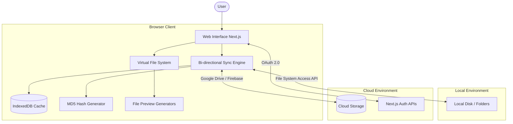
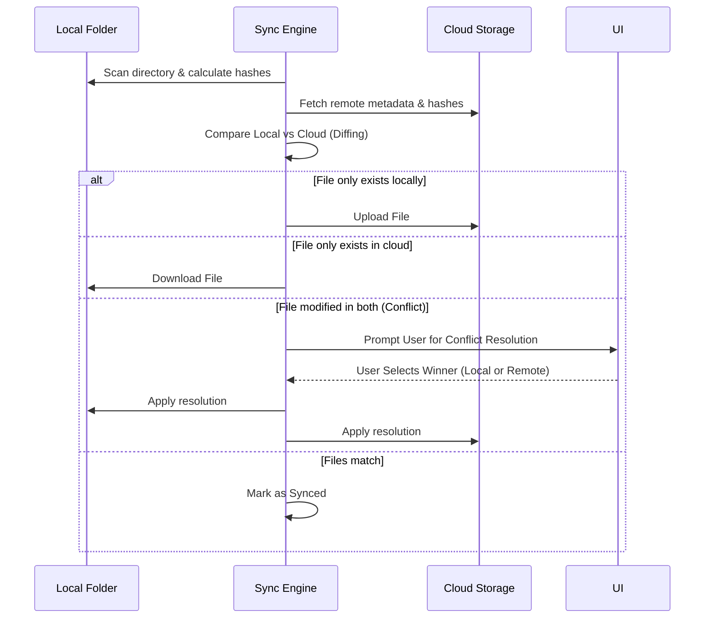

<div align="center">
  

  # ☁️ CloudSync

  *A powerful, modern, web-based, bi-directional file synchronization application.*

  [](https://nextjs.org/)
  [](https://react.dev/)
  [](https://www.typescriptlang.org/)
  [](https://tailwindcss.com/)
  [](https://firebase.google.com/)
</div>

<br />

CloudSync seamlessly bridges the gap between your local file system and cloud storage directly from the browser. No desktop client installation required. By utilizing the modern Web File System Access API, it brings native-like sync capabilities right to your web browser.

---

## 🎯 Why CloudSync?

- **Zero Installation**: Sync your files without downloading hefty desktop applications.
- **Privacy First**: Files are synchronized directly between your local machine and cloud storage. No intermediary servers hold your files.
- **Granular Control**: Manage conflicts manually or use `.syncignore` to ensure only the right files are synced.

---

## ✨ Key Features

- **🔄 Bi-directional Sync**: Real-time or manual synchronization between local directories and the cloud.
- **📁 Native File System Access**: Leverages the modern web File System Access API to securely interact with local folders directly.
- **⚔️ Smart Conflict Resolution**: An interactive UI to intelligently resolve collisions when files are modified both locally and remotely.
- **🚫 `.syncignore` Support**: Fully customizable ignore patterns using `.syncignore` (similar to `.gitignore`) to exclude `node_modules`, temp files, or private data.
- **👁️ Rich File Previews**: Built-in viewing capabilities for PDFs, Word documents (`.docx`), Images, and Text/Code without ever leaving the app.
- **📊 Storage Analytics**: Beautiful, interactive charts visualizing your storage usage and file distributions.
- **🔋 Wake Lock Management**: Utilizes the Screen Wake Lock API to prevent the device from going to sleep during prolonged synchronization tasks.
- **⚡ High-Performance Virtualization**: Smoothly renders massive directories containing thousands of files using virtualized lists.
- **🧠 AI Integration**: Integrates Google GenAI capabilities for smart data processing.

---

## 🛠️ Tech Stack

### Frontend & Core
- **Framework**: [Next.js](https://nextjs.org/) & [React 19](https://react.dev/)
- **Language**: [TypeScript](https://www.typescriptlang.org/)
- **Styling**: [Tailwind CSS v4](https://tailwindcss.com/) & [Framer Motion](https://motion.dev/)
- **Icons**: [Lucide React](https://lucide.dev/)

### Backend & Data
- **Backend Services**: Next.js API Routes, [Firebase](https://firebase.google.com/)
- **AI / Machine Learning**: `@google/genai`
- **Local Data**: IndexedDB (`idb-keyval`) for efficient metadata and state persistence

### Utilities
- **Virtualization**: `@tanstack/react-virtual` for windowing large lists
- **File Processing**: `spark-md5` (fast client-side file hashing), `pdfjs-dist` & `mammoth` (document previews)
- **Data Visualization**: `recharts`

---

## 🏗️ Architecture & Workflow

### High-Level Architecture



### Sync Resolution Workflow



---

## 🚀 Getting Started

### Prerequisites
- [Node.js](https://nodejs.org/) (v20+ recommended)
- A Google Cloud Console project (for Drive API and OAuth 2.0 credentials)
- Firebase Project (for Firebase services)

### Installation

1. **Clone the repository:**
   ```bash
   git clone https://github.com/Virendra-Phirke/CloudSync.git
   cd CloudSync
   ```

2. **Install dependencies:**
   ```bash
   npm install
   ```

3. **Environment Setup:**
   Create a `.env.local` file in the root directory and configure your credentials:
   ```env
   # Google OAuth Configuration
   GOOGLE_CLIENT_ID="your_google_client_id_here"
   GOOGLE_CLIENT_SECRET="your_google_client_secret_here"
   APP_URL="http://localhost:3000"
   GOOGLE_REDIRECT_URI="http://localhost:3000/api/auth/callback/google"
   
   # Firebase Configuration
   # (Add your Firebase env variables here)
   ```

4. **Run the development server:**
   ```bash
   npm run dev
   ```

5. **Open Application**: Navigate to [http://localhost:3000](http://localhost:3000) in your browser.

---

## 💡 Usage Guide

1. **Authenticate**: Log in with your account to grant CloudSync access to your cloud storage.
2. **Select Local Folder**: Use the UI to pick a local folder on your machine that you want to sync.
3. **Configure `.syncignore`**: Add a `.syncignore` file in your local folder to ignore specific files/directories (e.g., `node_modules/`, `.git/`).
4. **Sync**: Click the "Sync" button. CloudSync will analyze differences, prompt you to resolve any conflicts, and keep your files up-to-date!

---

## 📁 Project Structure

```text
├── app/                  # Next.js App Router and API routes
├── components/           # Reusable React components (UI, Modals, Views)
├── hooks/                # Custom React hooks (e.g., useMockAnalytics.ts)
├── lib/                  # Core business logic and utilities
├── modules/              # Feature modules (e.g., analytics)
├── public/               # Static assets
└── scripts/              # Build and utility scripts
```
