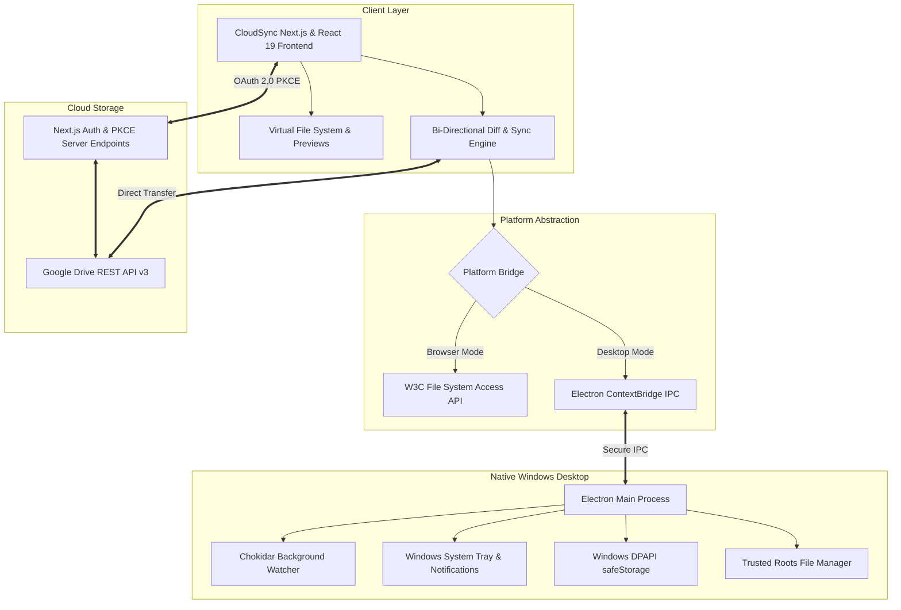

# ☁️ CloudSync

<div align="center">

**Next-Generation Bi-Directional Cloud File Synchronization**  
*Seamlessly synchronize local directories with Google Drive via modern browser APIs or a native Windows background client.*

[](https://nextjs.org/)
[](https://react.dev/)
[](https://www.typescriptlang.org/)
[](https://tailwindcss.com/)
[](https://www.electronjs.org/)
[](https://developers.google.com/drive)
[](LICENSE)

</div>

---

## 🌟 Overview

**CloudSync** is a modern, high-performance file synchronization platform designed to bridge local filesystems and cloud storage. It offers two first-class operational modes:

1. **🌐 Web Application (Zero Installation)**: Runs entirely within modern Chromium-based browsers (Chrome, Edge, Opera, Brave) utilizing the **W3C File System Access API**. No agent or desktop client installation required.
2. **🖥️ Native Windows Desktop Application**: Built with **Electron** and **TypeScript**, providing native file access, debounced continuous background file watching (`chokidar`), Windows System Tray minimization, native toast notifications, and Windows DPAPI encrypted credential storage.

---

## ✨ Key Features

### 🔄 Intelligent Bi-Directional Synchronization
- **MD5 Content Hashing**: Compares file content hashes (`spark-md5` client-side / Google Drive MD5 checksums) rather than relying solely on timestamps.
- **Fast Diffing Engine**: Accurately detects local additions, remote additions, modifications, and deletions.
- **Batched & Serialized Execution**: Prevents race conditions and duplicate uploads/downloads across concurrent triggers.

### ⚔️ Interactive Conflict Resolution
- Real-time side-by-side modal for files modified concurrently both locally and remotely.
- Displays file sizes, timestamps, and modification history to help you decide which version to keep.
- One-click bulk resolution options (e.g. *Keep All Local*, *Keep All Remote*).

### 🖥️ Dedicated Windows Desktop Client
- **Background File Watcher**: Monitors active sync folders using `chokidar` with debounced event coalescing (800ms quiet window) to prevent thrashing during rapid IDE saves.
- **System Tray Integration**: Operates quietly in the Windows notification area with live sync status indicators, quick sync actions, and one-click folder navigation.
- **Close-to-Tray**: Minimizes to the background tray when closed so sync schedules remain uninterrupted.
- **Native Toast Notifications**: Provides instant Windows balloon and notification updates when sync operations complete or encounter conflicts.
- **Windows Installer**: Production packaging via Electron Forge and Inno Setup for a complete standalone `.exe` installer.

### 🛡️ Enterprise Security & Privacy
- **OAuth 2.0 PKCE Flow**: Complete PKCE authorization code exchange keeping client secrets secure on the server.
- **Windows DPAPI Protection**: Desktop sessions encrypt refresh tokens at rest using Electron's native `safeStorage` (Windows Data Protection API).
- **Trusted Root Sandbox**: Desktop IPC requests validate all file access against cryptographic root IDs, preventing path traversal attacks outside selected folders.
- **Direct Cloud Sync**: Local files transfer directly between your machine and Google Drive without intermediate third-party storage.

### 🚫 Robust `.syncignore` Engine
- Exclude build artifacts, large binaries, or sensitive folders (e.g. `node_modules/`, `.git/`, `dist/`, `.env*`).
- Full standard `.gitignore` pattern matching support powered by `ignore`.

### 👁️ Rich In-App Previews
- **PDF Previews**: In-browser rendering powered by `pdfjs-dist`.
- **Word Documents**: `.docx` document parsing and previewing via `mammoth`.
- **Code & Text**: Syntax-highlighted viewer for source code and markdown documents.
- **Images**: Responsive, high-fidelity image inspection.

### 📊 Storage Analytics & Telemetry
- Interactive storage breakdowns visualized with **Recharts**.
- Real-time quota metrics (cloud quota consumed vs. available storage).
- File type distribution charts and sync performance telemetry.

### ⚡ Extreme Scale & Performance
- **List Virtualization**: Renders directories containing tens of thousands of files effortlessly via `@tanstack/react-virtual`.
- **Screen Wake Lock API**: Automatically prevents system sleep during heavy sync transfers in browser mode.

---

## 🏗️ Architecture


```mermaid
graph TB
    subgraph Client Layer
        UI[CloudSync Next.js & React 19 Frontend]
        VFS[Virtual File System & Previews]
        SyncEngine[Bi-Directional Diff & Sync Engine]
    end

    subgraph Platform Abstraction
        Adapter{Platform Bridge}
        WebFS[W3C File System Access API]
        DesktopBridge[Electron ContextBridge IPC]
    end

    subgraph Native Windows Desktop
        MainProcess[Electron Main Process]
        Watcher[Chokidar Background Watcher]
        Tray[Windows System Tray & Notifications]
        SafeStorage[Windows DPAPI safeStorage]
        TrustedRoots[Trusted Roots File Manager]
    end

    subgraph Cloud Storage
        DriveAPI[Google Drive REST API v3]
        AuthServer[Next.js Auth & PKCE Server Endpoints]
    end

    UI --> SyncEngine
    UI --> VFS
    SyncEngine --> Adapter
    Adapter -->|Browser Mode| WebFS
    Adapter -->|Desktop Mode| DesktopBridge

    DesktopBridge <==>|Secure IPC| MainProcess
    MainProcess --> Watcher
    MainProcess --> Tray
    MainProcess --> SafeStorage
    MainProcess --> TrustedRoots

    SyncEngine <==>|Direct Transfer| DriveAPI
    UI <==>|OAuth 2.0 PKCE| AuthServer
    AuthServer <==> DriveAPI
```

---

## 🛠️ Tech Stack

| Domain | Technology | Description |
| :--- | :--- | :--- |
| **Framework** | [Next.js 16 (App Router)](https://nextjs.org/) | Hybrid SSR & client runtime |
| **UI Library** | [React 19](https://react.dev/) | Core UI and state management |
| **Desktop Platform** | [Electron 34](https://www.electronjs.org/) | Native Windows desktop runtime |
| **Language** | [TypeScript 5.9](https://www.typescriptlang.org/) | Strict end-to-end type safety |
| **Styling** | [Tailwind CSS v4](https://tailwindcss.com/) & [Motion](https://motion.dev/) | Modern utility styles and micro-animations |
| **Cloud Storage** | [Google Drive API v3](https://developers.google.com/drive) | Remote file and metadata storage |
| **Desktop File Watcher** | [Chokidar](https://github.com/paulmillr/chokidar) | Debounced cross-platform filesystem watcher |
| **Local Cache** | [idb-keyval](https://github.com/jakearchibald/idb-keyval) | IndexedDB storage for file metadata |
| **Hashing** | [spark-md5](https://github.com/satazor/js-spark-md5) | High-speed incremental MD5 calculation |
| **Document Previews** | `pdfjs-dist` & `mammoth` | PDF and DOCX document renderers |
| **Visualizations** | [Recharts](https://recharts.org/) | Interactive telemetry and storage charts |
| **List Virtualization** | `@tanstack/react-virtual` | High-performance virtualized DOM lists |

---

## 📁 Project Structure

```text
omnisync/
├── app/                        # Next.js App Router
│   ├── api/auth/               # OAuth 2.0 & PKCE auth endpoints
│   │   ├── desktop/            # Desktop PKCE token exchange & refresh
│   │   └── callback/google/    # Web OAuth redirect handler
│   ├── layout.tsx              # Root HTML layout and metadata
│   └── page.tsx                # Main entry view
├── components/                 # React components
│   ├── Dashboard.tsx           # Primary dashboard layout
│   ├── FilesView.tsx           # Virtualized file explorer & previews
│   ├── SettingsView.tsx        # Sync & account configuration
│   ├── StorageView.tsx         # Storage analytics and charts
│   ├── SyncContext.tsx         # State provider & sync engine coordinator
│   └── modals/                 # Conflict resolution & preview modals
├── desktop/                    # Native Windows Desktop Client
│   ├── electron/               # Electron main, preload, and services
│   │   ├── main/               # Window lifecycle, IPC handlers, system tray
│   │   ├── preload/            # contextBridge secure API exposure
│   │   ├── services/           # File watcher, auth, storage, notifications
│   │   ├── utils/              # Path sanitization, logger, icon resolver
│   │   ├── forge.config.js     # Electron Forge packaging configuration
│   │   └── installer.iss       # Inno Setup Windows installer script
│   └── scripts/                # Development & build automation runners
├── lib/                        # Core utilities & services
│   ├── desktopAdapter.ts       # Unified adapter mapping FileSystemHandle to desktop IPC
│   ├── drive.ts                # Google Drive REST API client
│   ├── localFolder.ts          # Web File System Access API manager
│   ├── oauth.ts                # Cross-platform authentication helper
│   ├── serverCrypto.ts         # AES-256-GCM token encryption
│   └── syncEngine.ts           # Hash-based diffing & bi-directional sync engine
└── types/                      # TypeScript declarations (Desktop IPC & Models)
```

---

## 🚀 Getting Started

### Prerequisites
- **Node.js** v20 or higher
- **npm** v10 or higher
- A **Google Cloud Console** project with **Google Drive API** enabled

### 1. Clone the Repository
```bash
git clone https://github.com/Virendra-Phirke/CloudSync.git
cd CloudSync
```

### 2. Install Dependencies
```bash
npm install
```

### 3. Configure Environment Variables
Create a `.env.local` file in the project root:

```env
# Google OAuth 2.0 Credentials (from Google Cloud Console)
GOOGLE_CLIENT_ID="your-client-id.apps.googleusercontent.com"
GOOGLE_CLIENT_SECRET="your-client-secret"
GOOGLE_REDIRECT_URI="http://localhost:3000/api/auth/callback/google"

# Application URL
APP_URL="http://localhost:3000"

# Optional: Custom encryption secret for desktop auth tokens (defaults to GOOGLE_CLIENT_SECRET)
SESSION_SECRET="your-strong-random-session-secret"

# Optional: Gemini API Key for AI features
GEMINI_API_KEY="your-gemini-api-key"
```

> **Google OAuth Configuration Tip:**  
> In your Google Cloud Console OAuth 2.0 client credentials, ensure the following **Authorized Redirect URIs** are registered:
> - `http://localhost:3000/api/auth/callback/google` (for Web OAuth flow)
> - Your production URL callback (e.g. `https://your-domain.com/api/auth/callback/google`)

---

## 💻 Running the Application

### Option A: Web Application
Start the Next.js development server:
```bash
npm run dev
```
Open [http://localhost:3000](http://localhost:3000) in **Google Chrome**, **Microsoft Edge**, or any browser supporting the File System Access API.

### Option B: Windows Desktop Application
Launch the standalone desktop application in development mode:
```bash
npm run desktop:dev
```
*This command verifies that the Next.js server is ready, compiles desktop TypeScript, and launches the Electron application with active DevTools.*

---

## 📦 Building for Production

### Build Web Application
```bash
npm run build
npm run start
```

### Build Windows Desktop App & Installer
```bash
npm run desktop:build
```
This script compiles the production web app, builds the desktop assets, and generates the Windows distributable via Electron Forge into `desktop/electron/out/`.

For full details on desktop packaging, Inno Setup installers, and architecture, refer to the [Desktop Documentation](desktop/electron/README.md).

---

## 📜 Available Scripts

| Script | Command | Description |
| :--- | :--- | :--- |
| `npm run dev` | `next dev` | Starts Next.js development server |
| `npm run build` | `next build` | Compiles production Next.js bundle |
| `npm run start` | `next start` | Runs production Next.js server |
| `npm run lint` | `eslint .` | Runs ESLint checks |
| `npm run desktop:dev` | `node desktop/scripts/dev.js` | Launches Electron desktop app in development |
| `npm run desktop:build`| `node desktop/scripts/build.js`| Builds standalone Windows desktop application |

---

## 🔒 Security & Privacy

- **No Third-Party Intermediaries**: Your files never pass through external storage servers. All transfers occur directly between your local machine and Google Drive.
- **Zero Exposed Secrets**: `GOOGLE_CLIENT_SECRET` and authorization keys remain exclusively on server-side Next.js endpoints. Desktop clients authenticate securely via PKCE.
- **Credential Storage**: Desktop refresh tokens are stored encrypted using Windows DPAPI (`safeStorage`).
- **Sandboxed File Access**: The desktop client restricts filesystem operations strictly to explicitly selected user folders via a secure root ID mapping.

---

## 🤝 Contributing

Contributions are welcome! If you'd like to report an issue or submit a feature request:
1. Fork the repository.
2. Create a feature branch (`git checkout -b feature/amazing-feature`).
3. Commit your changes (`git commit -m "feat: add amazing feature"`).
4. Push to the branch (`git push origin feature/amazing-feature`).
5. Open a Pull Request.

---

## 📄 License

This project is licensed under the [MIT License](LICENSE).
